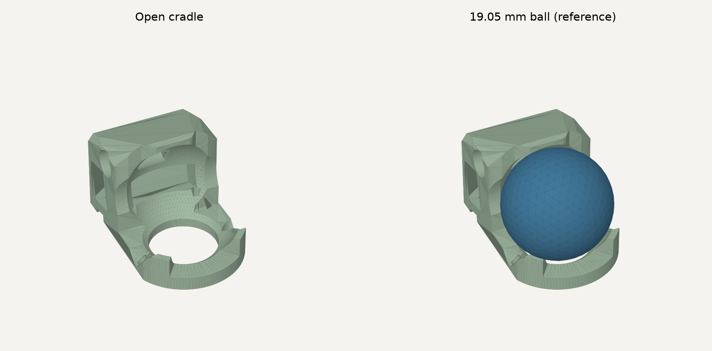

# 19.05 mm 開放型トラックボールケース（試作）

写真のようにボール周囲の樹脂を減らすための別ケースです。既存のセンサーガイド追加版を基準に、ベアリング支持部の間の壁を3か所取り除いています。元ファイルは変更していません。完全に異なる取り付け方式へ変更するものではなく、センサー収納部・後方支持部・固定穴を引き継いだ開放型です。

- 印刷用：[`trackball-case-19mm-open-Body.stl`](../STL/trackball-case-19mm-open-Body.stl)
- FreeCAD表示用：[`trackball-case-19mm-open.FCStd`](trackball-case-19mm-open.FCStd)
- 生成スクリプト：[`generate-open-trackball-case.py`](generate-open-trackball-case.py)
- 検証結果：[`trackball-case-19mm-open-Body.validation.json`](../STL/trackball-case-19mm-open-Body.validation.json)



## 構造

19.05 mm POMボール、4×1.5×2 mmベアリング3個、M1.4×5 mmのベアリング固定ねじ、既存センサーモジュールを使う想定です。後方のM2固定穴とセンサー溝を維持しています。下部2.5 mmのフレームを残し、前方と左右に開口を設けています。中央の底穴も元形状のままです。

ベアリング支持部の残る角度は前方の左右38〜78度と−78〜−38度です。後方のセンサー収納部はX≤−6 mmの領域を残しています。球面を樹脂で支える設計ではなく、組み立て時にはベアリング3個で支えてください。

保持用の壁が減るため、持ち運び時にボールが外れる可能性があります。スナップ保持は保証していません。強度・印刷公差・ベアリング外輪の回転余裕・実センサー部品との干渉は実物で未検証です。

## データ上の検証

元ケース内面の球面から求めた中心(0, 0, 9.8) mmを基準にしています。支持された実ボールの中心はまだ実測していません。この公称位置で半径10.025 mmの球（ボール半径9.525 mm＋0.50 mm）との重なり体積が0であることを、保存したSTLの再読み込み後に検証しました。

元の旧版とセンサーガイド追加版も、この同じ公称位置・半径では重なり体積0でした。したがって、現物の引っかかりをガイド追加だけのせいと断定する根拠はありません。開口は擦れ得る壁を減らし、接触の確認と清掃をしやすくする変更です。

閉じたメッシュ、面の向き、接続成分1、後方収納部と下部フレームの維持を検証しています。ベアリングやねじの実部品モデルを含む組立干渉検証ではありません。プレビューの球も位置参照用です。

## 印刷・確認

底面を下に配置してください。薄い壁とセンサー溝があるため、スライサーで壁の欠落やオーバーハングを確認し、必要なサポートを付けます。ベアリング座と溝に残ったサポートやバリは取り除いてください。

まずセンサーなしでベアリングとボールを組み、各方向に転がして擦れと支持部のたわみを確認してください。次にセンサーを装着して位置を調整します。取り付けねじの締め付け前後でも動きを確認してください。実機確認までは旧ケースの置き換え推奨にはしていません。

## 再生成

`numpy`、`trimesh`、`manifold3d`を使用します。プレビューには`matplotlib`が必要です。

```sh
python 3d-models/FreeCAD/generate-open-trackball-case.py \
  --preview img/trackball-case-19mm-open-preview.png \
  --freecadcmd /Applications/FreeCAD.app/Contents/Resources/bin/freecadcmd \
  --cad-output 3d-models/FreeCAD/trackball-case-19mm-open.FCStd
```

FreeCADを使わずSTLだけ生成する場合は、`--freecadcmd`と`--cad-output`を省略できます。FCStdは生成済みメッシュと非表示の参照球を収録しています。メッシュを寸法駆動するCADではなく、形状の変更はスクリプトの`BASE_HEIGHT`と`WINDOWS`で行ってください。
