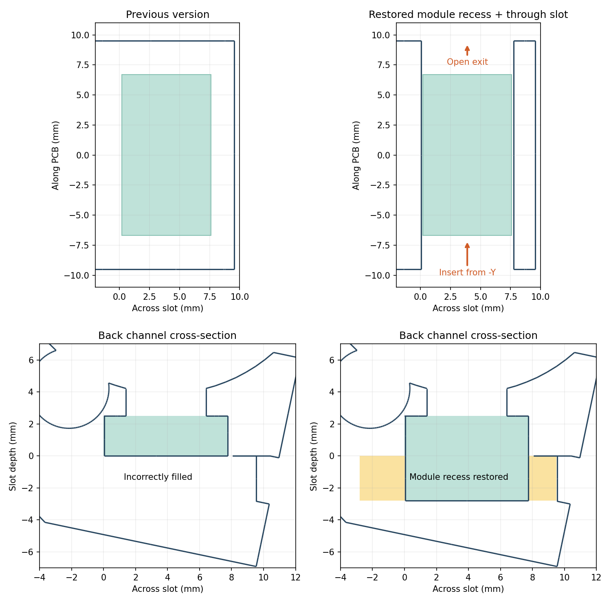

# 19 mmトラックボールケースのセンサーモジュール用ガイド

印刷には [`trackball-case-19mm-ortho-sensor-fit-Body.stl`](../STL/trackball-case-19mm-ortho-sensor-fit-Body.stl) を使用してください。再生成の入力に使う元STLは残しています。旧FreeCADファイルは削除し、調整版FCStdへ置き換えています。

対象は [sekigon-gonnoc/small-mouse-sensor-module](https://github.com/sekigon-gonnoc/small-mouse-sensor-module) のPAW3222モジュールです。READMEの「14×8 mm」は概略寸法で、[公式寸法図](https://github.com/sekigon-gonnoc/small-mouse-sensor-module/blob/main/img/size.png) の基板外形は **13.4×7.4 mm** です。

## 両側に貫通したセンサー溝

センサー溝は **-Y側と+Y側の両方に貫通** しています。位置決めストッパーは設けず、どちらからでも基板を挿入・取り外しでき、反対側から押し戻すこともできます。

| 項目 | 調整版 |
| --- | --- |
| 挿入・取り外し | 両側から可能 |
| ガイド間の短辺寸法 | 7.7 mm（基板7.4 mmに対して片側0.15 mm） |
| 長辺方向 | 貫通。位置決めストッパーなし |
| 基板背面の凹み | 約2.8 mmを確保し、両側に貫通 |
| 光学窓側の部品用凹み | 元の2.5 mmを維持 |

センサーを元ケースと同じ向きで保持し、側面の溝に基板端を合わせて中央まで滑り込ませます。短辺方向のガイドで横ズレと回転を抑えますが、長辺方向はスライドできます。光学窓、ボール支持部、固定穴、ケースの最大外形は維持しています。



片側0.15 mmは設計上の印刷余裕です。実機の印刷・組み付けは未検証です。まず試し刷りで挿入具合を確認してください。硬い場合は無理に押し込まず、生成スクリプトの `--clearance` で調整できます（0より大きく0.2 mm未満）。

## 背面空洞の補強

背面の空洞は単なる不要な隙間ではなく、センサーモジュールの基板を収める空間でもあります。[組み立て写真](../../img/trackball-case-3.JPG)と照合し、そのうち幅7.7 mmの基板通過領域を残しました。背面約2.8 mmと光学窓側2.5 mmの凹みをつなげた領域が、ケース側面の両端まで貫通しています。

補強材はこの通過領域の外側に限定しています。背面の隙間を全面的に埋めてしまうとモジュールの収納を妨げるため、必要な凹みは残しています。固定ねじ穴と光学窓も維持しています。

## FreeCADファイル

[`trackball-case-19mm-ortho-sensor-fit.FCStd`](trackball-case-19mm-ortho-sensor-fit.FCStd) は元STLと調整後STLのメッシュを収録しています。標準表示は `FittedCase` です。`OriginalCase` と表示を切り替えて比較できます。寸法プロパティは参照用で、形状変更は下記スクリプトで行ってください。

元のパラメトリックFreeCADモデルはFreeCAD 1.1で再計算すると既存のベアリング台座に複数ソリッドのエラーが出るため、調整版は印刷用STLを基準にしています。

## 再生成

Python環境に `numpy`、`trimesh`、`manifold3d` を用意し、リポジトリ直下で実行します。入力には元のSTLを使ってください。調整済みSTLを入力にすると隙間を広げられません。

```sh
python 3d-models/FreeCAD/fit-trackball-sensor.py \
  --input 3d-models/STL/trackball-case-19mm-ortho-Body.stl \
  --output 3d-models/STL/trackball-case-19mm-ortho-sensor-fit-Body.stl \
  --clearance 0.15
```

FreeCADファイルも保存する場合は `--freecadcmd` にFreeCADのコマンド実行ファイル、`--cad-output` に保存先FCStdを指定します。

STLは一般的なバイナリ形式です。微小面を0.0001 mmの許容差で整理し、保存時の頂点丸めによる非多様体化を防いでいます。生成時に元ケースの除去体積、追加ガイドの接続、面の向き、閉じたメッシュであること、保存後のSTLの再読み込みを検証します。今回の結果は追加体積252.255 mm³、除去体積は数値誤差範囲（0.000001 mm³未満）、接続成分1、閉じたメッシュです。調整版FCStdを再読み込みした際も閉じたメッシュであることを確認しました。

追加で、背面側の基板収納空間を含め、幅7.4 mm・深さ5.28 mm（約5.3 mmの元の空間から両面0.01 mmずつ控えた領域）をケースの片側から反対側まで掃引し、挿入・取り外しの干渉を検証しています。保存後STLでの干渉体積は0 mm³でした。基板だけでなく背面の凹みまで検証対象に含めています。

実モジュールの部品高さ、FPCの取り回し、印刷公差は実物で未検証です。背面固定ねじ穴と光学窓への非干渉、最大外形の維持も検証しています。
