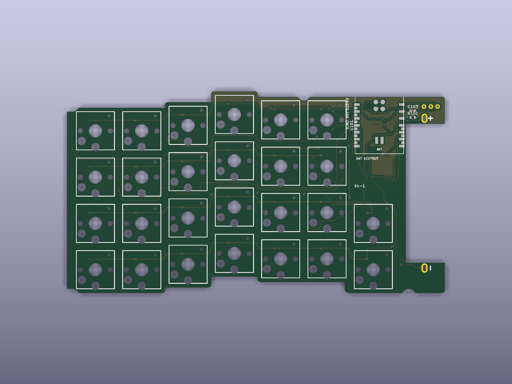
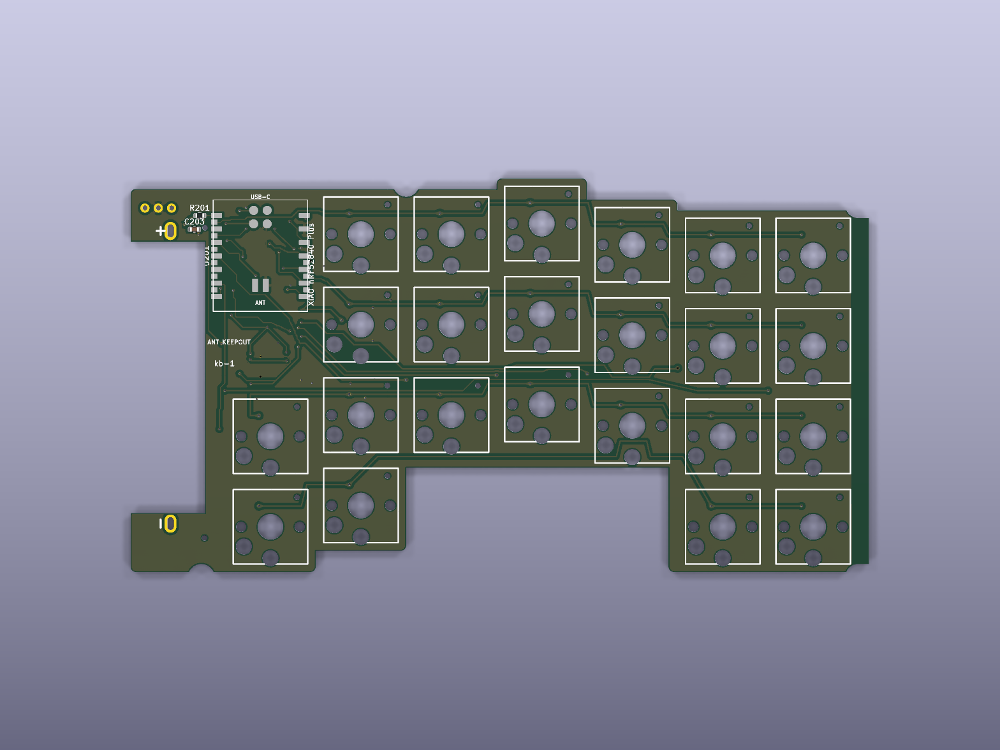

# kb-1

kb-1は、19mmトラックボールを搭載した無線分割キーボードです。

コンパクトな17mmピッチのカラムスタッカード配列を採用し、左右合わせて49キーを搭載しています。
トラックボールの高さを低く抑えることで、キーを打つときや持ち運びの邪魔になりにくくしています。
コントローラーにはSeeed Studio XIAO nRF52840 Plusを採用し、左右それぞれ単四電池1本で動作します。

## [torabo-tsuki LPの情報はこちら](https://github.com/sekigon-gonnoc/torabo-tsuki-lp)

| 左側PCB | 右側PCB |
| --- | --- |
|  |  |

## [ビルドガイド](build-guide.md)

## 特徴

* 17mmピッチのカラムスタッカード配列
  * 左26キー、右23キーの49キー構成です。
* 左右それぞれ単四電池1本で動作
  * Ni-MH電池またはアルカリ電池で動作します。
* Seeed Studio XIAO nRF52840 Plusを採用
  * XIAOと左右の5V昇圧回路を基板上に搭載しています。
* トラックボールの設置位置が調整可能
  * トラックボールを取り付ける位置を調整して、自分にとって一番操作しやすい位置に設置できます。ボールの高さを抑えたことでキーを打つときの邪魔になりにくなっています。
* ZMK対応
  * keymap-editorやZMK Studioを使用して簡単にキーマップが変更できます。

## 使用上の注意

* 異臭や煙が出たときは、ただちに使用を中止して電源を切り電池を抜いてください。
* 電池から漏れた液が目に入った場合は、失明する恐れがあるのですぐにきれいな水でよく洗い、医師の診断を受けてください。
* 電池の+-を正しくセットしてください。
* 使い切った電池は速やかに取り出してください。
* 長期間使用しない場合は電池を取り出してください。

## 設計データについて

本リポジトリでは、kb-1の基板設計データと19mmトラックボールケースの設計データを公開しています。

トラックボールケースは従来版から変更していません。kb-1用の本体ケースおよび電池カバーは未設計です。

ライセンスにしたがって自由に利用していただいて構いませんが、問い合わせには対応しません。
