## 部品

| 名称                                                                          | 数   | 補足、入手先                                                                                                                                                 |
| ----------------------------------------------------------------------------- | ---- | ------------------------------------------------------------------------------------------------------------------------------------------------------------ |
| **本体関連**                                                                  |
| メイン基板                                                                    | 各1  | JLCPCBなどで製造                                                                                                                                             |
| トッププレート                                                                | 2    | JLCPCBなどで製造                                                                                                                                             |
| ボトムプレート                                                                | 2    | JLCPCBなどで製造                                                                                                                                             |
| 電池ボックス(単三)                                                            | 2    | [秋月電子](https://akizukidenshi.com/catalog/g/g100308/)                                                                                                     |
| 3mm砲弾型LED                                                                  | 2    | 青・白は不可                                                                                                                                                 |
| 抵抗(470Ω、1/6W)                                                              | 2    | 秋月電子など                                                                                                                                                 |
| スライドスイッチ(ISH-1260-HA-G)                                               | 2    | 秋月電子など                                                                                                                                                 |
| BMP Boost                                                                     | 2    | [BOOTH](https://booth.pm/ja/items/1177319), [遊舎工房](https://shop.yushakobo.jp/products/10737)                                                             |
| コンスルー                                                                    | 4    | [遊舎工房](https://shop.yushakobo.jp/products/31)で13ピン（高さ2.5mm）を購入してください。欠品している場合は12ピンを5個買って、1個を切り離して使ってください |
| スペーサー(4.5mm)                                                             | 8    | [ヒロスギネット](https://www.hirosugi-net.co.jp/shop/g/g2387/), [遊舎工房](https://shop.yushakobo.jp/products/a0800r2?variant=47615915294951)など            |
| ねじ(M2x3.5)                                                                  | 18   | [ウィルコ](https://wilco.jp/products/F/FX-EB.html#page3)など                                                                                                 |
| **トラックボール部品**                                                        |      |
| トラックボールセンサー(14mmマウスセンサーモジュール)、FFCコネクタ変換基板付き | 1    | [BOOTH](https://booth.pm/ja/items/6520217)                                                                                                                   |
| フレキシブルケーブル(0.5mmピッチ、6P、150mm、電極同一面)                      | 1    | Amazon, Aliexpressなど                                                                                                                                       |
| ベアリング(4x1.5x2 mm)                                                        | 3    | [Amazon](https://www.amazon.co.jp/dp/B0CV75YFQY)など                                                                                                         |
| ねじ(M1.4x5 mm)                                                               | 3    | Amazonなど                                                                                                                                                   |
| **その他**                                                                    |      |                                                                                                                                                              |
| キースイッチ(Choc V2)                                                         | 42   | Lofree系も可                                                                                                                                                 |
| キーキャップ                                                                  | 適量 | 17mmピッチのもの                                                                                                                                             |
| 19.05mm POMボール                                                             | 1    | Aliexpressなど                                                                                                                                               |
| 電池カバー、トラックボールケース                                              | 1式  | 3Dプリントサービスや自前で出力してください。JLC3DPだと送料込みで$5くらいで製造できます（詳細は後述）                                                         |
| ゴム足                                                                        | 8    | GRIPLUSなど薄型の物がおすすめです                                                                                                                            |
| 単三電池                                                                      | 2    | Ni-MH可。USBで充電できるリチウム電池内蔵のものを使う場合、必ずキーボードから取り外してから充電してください                                                   |
 

## 必要な工具
- はんだごて、はんだ
- ニッパー
- ペンチ
- ドライバー
- （やすり）
- PC
- USBケーブル

## 3Dプリント部品の製造(JLC3DP利用)

[JLC3DP](https://jlc3dp.com/jp/3d-printing-quote)にアクセスします。

[3d-models/STL](3d-models/STL/)フォルダのSTLファイルの中身をJLC3DPにアップロードします。

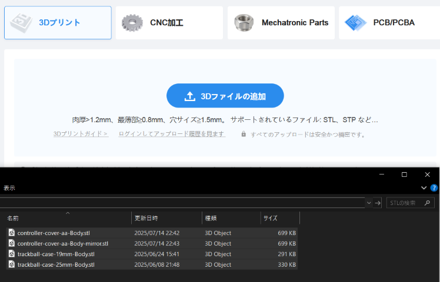

読み込んだすべてのファイルについて、商品概要は`エンクロージャー...`から`プラスチックエンクロージャ`を選択します。

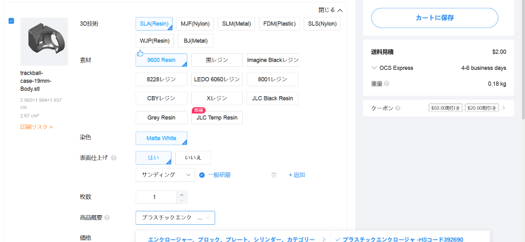

モデルのサムネイルの下に`印刷リスク`の表示がある場合は`はい`をチェックしてください。

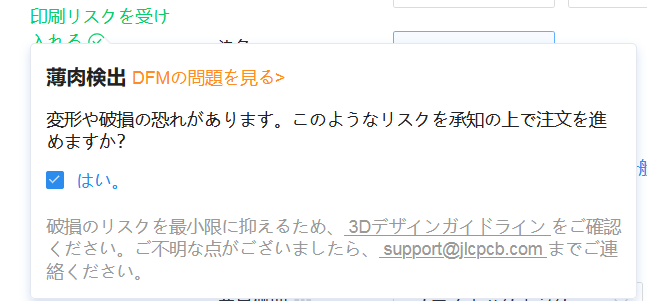

カートに保存し、注文手続きを進めます。配送方法はOCSを選択すると2ドルで配送してもらえます（2025年7月時点、月3回まで）。

発注履歴が表示されるようになった状態で数分経ってからタブをリロードすると、ファイル名の横に!マークが表示されることがあります。

その場合は!マークをクリックし、`はい`を選択してください。

| 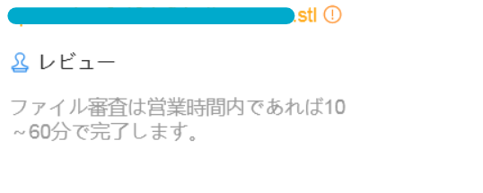 | 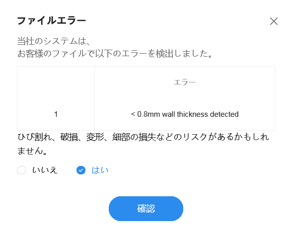 |
| ------------------------ | -------------------------- |

JLC3DPによるレビュー中にメールで問い合わせが来る場合がありますが、そのまま製造するように依頼してください。
気になる人は自分でCADデータを修正してください。

## 組立手順

### トッププレートのトラックボール搭載部分を切り離す

ニッパーでそのまま切り離せない場合は、表裏に切れ目を入れてから折り取ってください

### ダイオード・ソケットをはんだ付けする

|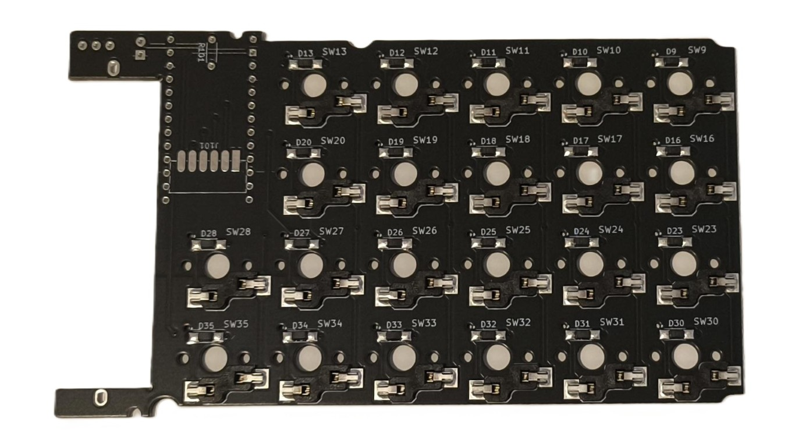|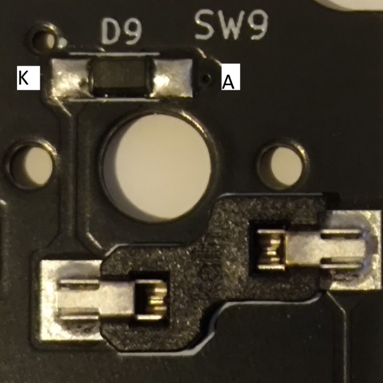|
|-|-|

### アダプタ変換基板をはんだ付けする

コンスルー用の穴にはんだが流れ込まないようにマスキングしてはんだ付けします。

また、アダプタ基板がコンスルー用の穴を塞がないようにしてください。調整が難しい場合はコンスルーを刺した状態で基板をはんだ付けしてください。

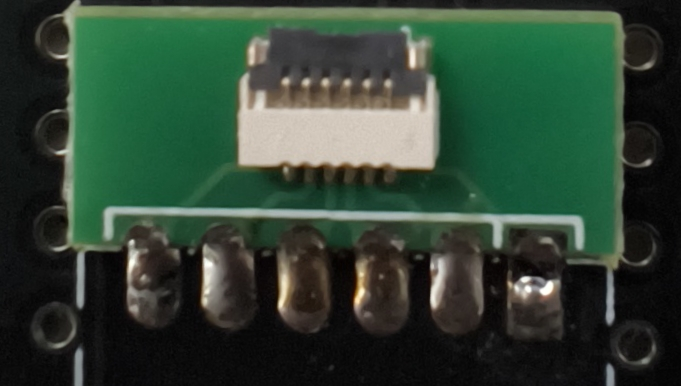

### LED・抵抗・スライドスイッチをはんだ付けする

LED・スライドスイッチは表側に、抵抗は裏側にはんだ付けしてください。

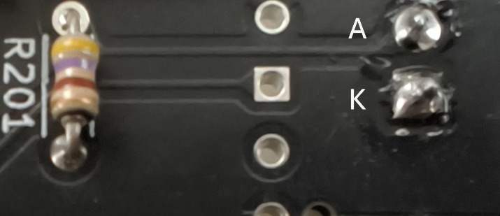

### 電池ボックスをはんだ付けする

* 電池ボックスの足を折り曲げます。
* ボトムプレートに電池ボックスを載せ、その上からメイン基板を載せます。向きに注意してください。
* 余った足を短く切ってからはんだ付けします。メイン基板とボトム基板がぴったりくっついた状態ではんだ付けするようにしてください。

|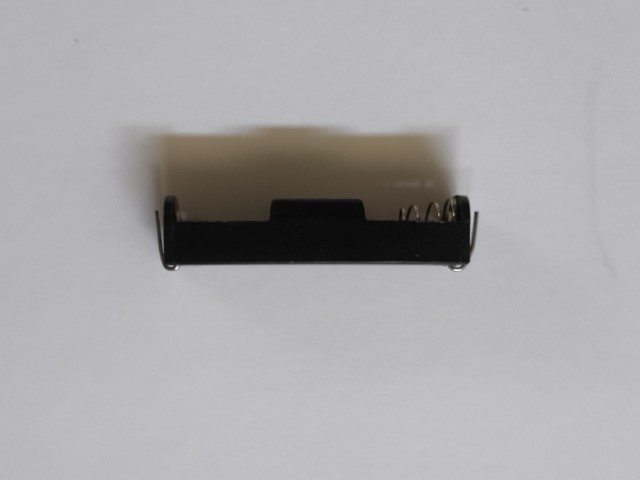|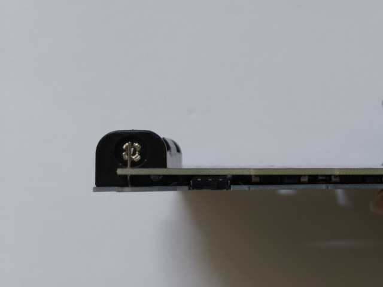|
|-|-|
|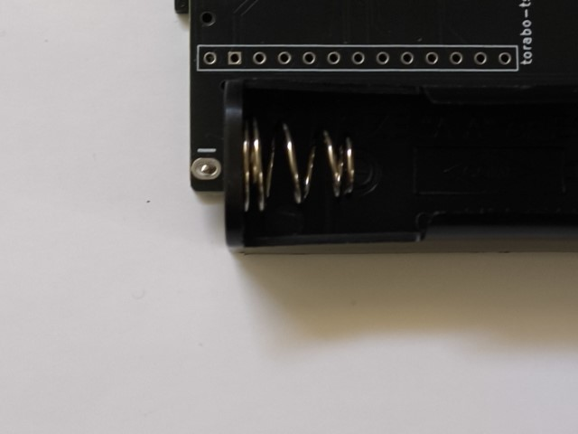

### トッププレート・メイン基板にスイッチを差し込む

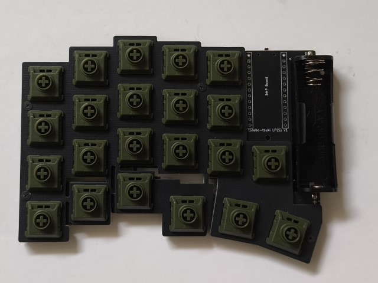

### メイン基板にBMP Boostをコンスルーで取り付ける

* はんだ付けは不要です。
* コンスルーの向きは揃えてください。

||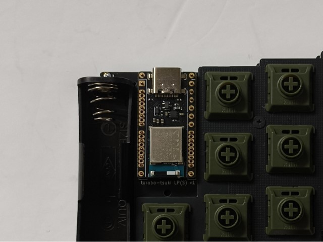|
|-|-|

### ファームウェアを書きこむ

* スイッチをOFFにした状態で、BMPをPCにUSBケーブルで接続します。
* BLEMICROPROという名前のストレージがマウントされたら、中身にINFO_UF2.TXTがあることを確認してください。
* [Releases](https://github.com/sekigon-gonnoc/zmk-keyboard-torabo-tsuki-lp/releases)からファームウェアのuf2ファイルをダウンロードします。
* uf2ファイルを1つ選んでストレージにコピーしてください。トラックボールがあるほうがCentral、ないほうがPeripheralです。
  * たとえば右側トラックボールで組み立てた場合、右手に`torabo_tsuki_lp_right_central`、左手に`torabo_tsuki_lp_left_peripheral`を書き込んでください。
* 書き込みが完了したら一度USBケーブルを抜き、スイッチをONにした状態でUSBケーブルを差し直すとキーボードとして動作します。

### トッププレートにスペーサーをねじ止めする

* スペーサーをトッププレートにねじ止めします。

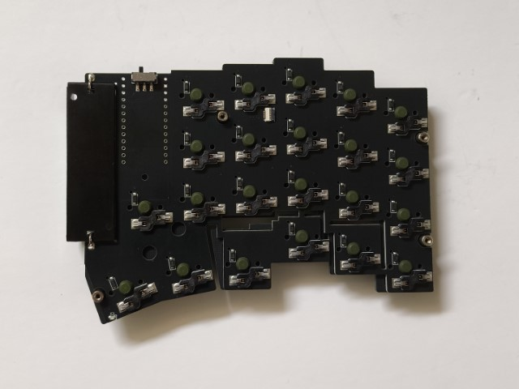

### トラックボールケースにベアリングをネジで固定する

* ケースに空いている穴にねじを押し込みながら回すようにしてベアリングを固定します。
* ベアリングは多少ガタつきますが問題ありません。

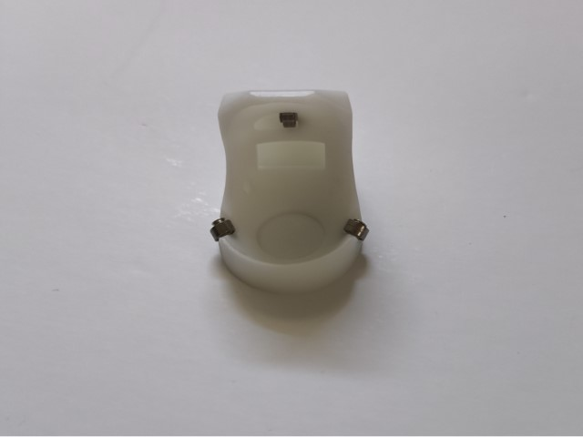

### トラックボールセンサーにケーブルを差し込む

* コネクタのフラップ（黒い部分）を上に持ち上げ、トラックボールのケーブルをしっかり奥まで差し込み、フラップを下げます。
  * [コネクタの操作方法と注意点をよく確認してください](https://www.hirose.com/ja/product/document?clcode=&productname=&series=FH19C__FH19SC&documenttype=Catalog&lang=ja&documentid=D31611_ja)

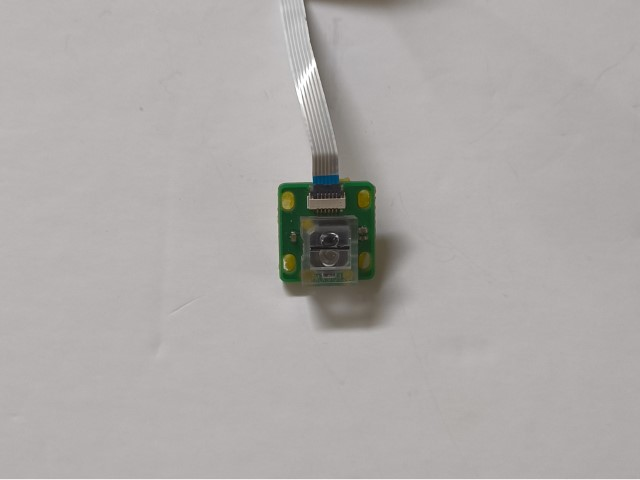

### トラックボールのケーブルをメイン基板のコネクタに差し込む

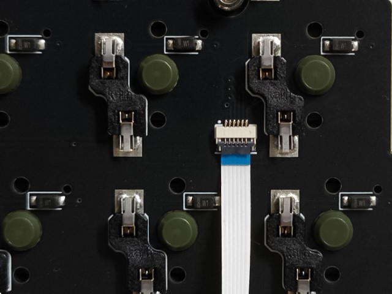

### センサーの動作確認をする

* USBケーブルでPCとBMP Boostを接続します。
* センサーのレンズ側を机から2mmくらい浮かせてセンサー基板を動かしたり、レンズの上空を指で動かしたりしてマウスカーソルが動くならば、センサーは正常に動作しています。 
* センサーの動作確認ができたらUSBケーブルは取り外してください。

### トラックボールセンサーをケースに取り付ける

* ケースの中央あたりまで差し込みます。
* 緩すぎてすぐ抜けてしまう場合は紙などを挟んで調節してください。
* きつすぎる場合は背面の突起を削ってください。
* トラックボールの反応が悪い場合には取り付け位置を調整してください。

|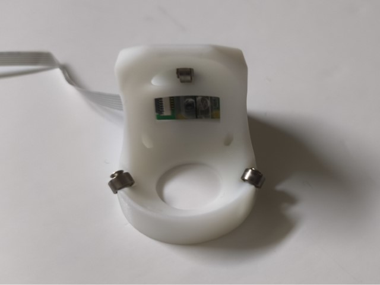|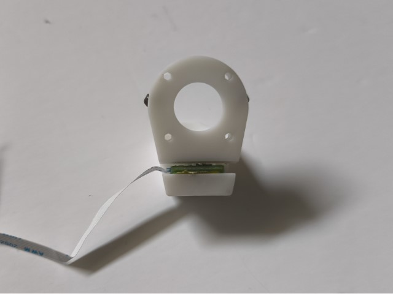|
|-|-|

### ボトムプレートを取り付け、ボトムプレートにトラックボールケースを取り付ける

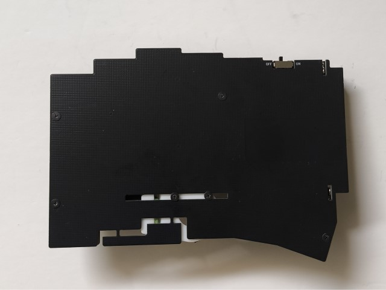

### トラックボールケースにボールを入れる

* ボールをケースに押し込んで入れます。

### 電池を入れる

* 電池をケースに入れます。向きに注意してください。

### 電池カバーを付ける

* 電源スイッチの穴にノブを通すように前側の爪をひっかけます
* 後側の爪を引っ張りながらメイン基板にひっかけます。

|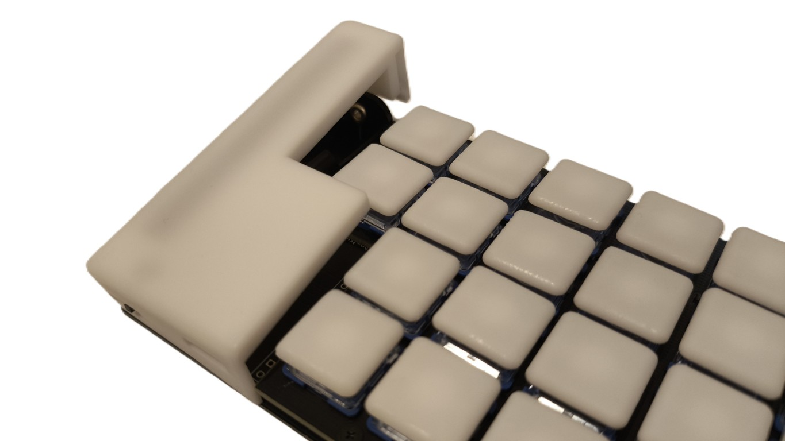|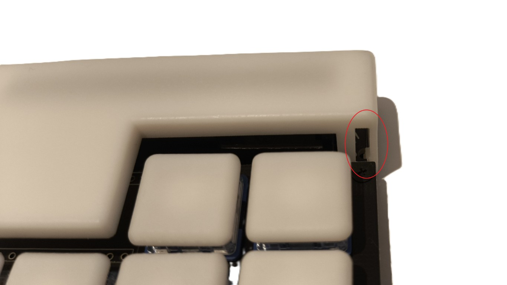|
|-|-|

### ゴム足を付ける

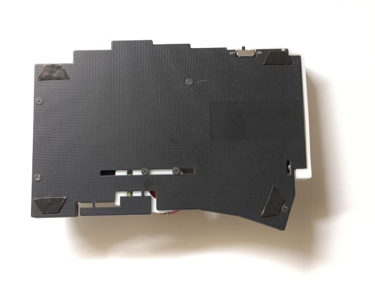

### キーキャップを取り付ける

**以上で組立は完了です、お疲れさまでした。**

## 使い方

### 電源の説明

* スライドスイッチをON側(内側)に切り替えると電源が入ります。電源がONするとLEDが点滅します。
* 有線接続する場合でもスライドスイッチはON側にしてからケーブルを接続してください。OFFの状態で接続した場合はブートローダが起動します。

### LEDの説明

親指のところに赤色LEDがついています。

* 起動時：点滅回数(1~3)でバッテリー残量を示しています
* ペアリング中：ペアリング先を探している間、数秒に1回点灯します。ペアリングが完了すると1回点灯します。

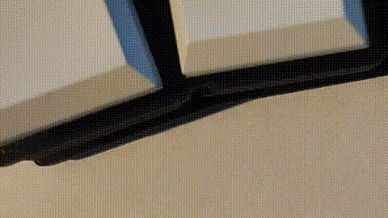

### 無線接続

* 両手のスライドスイッチをONして、接続先のデバイスでペアリングします。

### キーマップを変更する

* [ZMK Studio](https://zmk.studio/)または[Keymap-Editor](https://nickcoutsos.github.io/keymap-editor/)でキーマップが変更できます。
* Keymap-Editorを使用する場合は[zmk-keyboard-torabo-tsuki-lp](https://github.com/sekigon-gonnoc/zmk-keyboard-torabo-tsuki-lp)をクローンして編集してください。
  * Keymap-Editorの仕様によりconfig/info.jsonはLサイズ用になっているため、S,Mサイズには存在しないキーも表示されます。

## FAQ

まずはZMKのドキュメントを確認してください。

### 無線接続に問題がある

* 電源が入っているか確認してください。
* ZMKのドキュメントを確認してください。

### トラックボールの動きだしが遅い

* 一定時間ボールを動かさなかった場合にセンサーがスリープ状態になります。スリープ状態の解除に少し時間がかかるため動き出しが遅くなる場合があります。

### トラックボールの動きがおかしい/動かない

* [センサーの位置調整](#トラックボールセンサーをケースに取り付ける)をご確認ください。
* トラックボールのケーブルがコネクタにしっかりささっているか確認してください。
* センサーの仕様として、最大速度24inch/s、最大加速度10Gという制約があります。25mmボールの回転速度に換算すると9回転/sが最大速度で、これを超える速度で回転させた場合にはカーソルが逆方向に動くことがあります。

### 一部のキーが入力できない

* スイッチの足が折れ曲がっていないか、BMP Boostが浮いていないか確認してください。

### トラックボールの移動速度を変えたい/オートマウスレイヤー/スクロールレイヤーを使用したい

* ZMKのinput processorを使用してください。
