## 部品

写真には旧リビジョンの基板が含まれます。左右間接続の部品・ピン配置・はんだ付け方向は、以下の現行記述と製造用PCBデータを優先してください。

| 名称                                                                          | 数   | 補足、入手先                                                                                                                                                 |
| ----------------------------------------------------------------------------- | ---- | ------------------------------------------------------------------------------------------------------------------------------------------------------------ |
| **本体関連**                                                                  |      |                                                                                                                                                              |
| メイン基板                                                                    | 各1  | JLCPCBなどで製造                                                                                                                                             |
| トッププレート                                                                | 2    | JLCPCBなどで製造                                                                                                                                             |
| ボトムプレート                                                                | 2    | JLCPCBなどで製造                                                                                                                                             |
| Seeed Studio XIAO nRF52840 Plus                                               | 1    | [遊舎工房](https://shop.yushakobo.jp/products/10946)など。SenseではなくPlusを使用し、右側メイン基板へ表面実装します                                         |
| Samtec FTSH-106-01-L-D-K（12極ヘッダ）                                       | 2    | 左右各1。[DigiKey Japan](https://www.digikey.jp/ja/products/detail/samtec-inc/FTSH-106-01-L-D-K/7433351)など。1.27 mmピッチ、2列、スルーホール品。利用者が手はんだします |
| Samtec FFSD-06-D-10.00-01-N（両端ソケットケーブル）                           | 1    | [DigiKey Japan](https://www.digikey.jp/ja/products/detail/samtec-inc/FFSD-06-D-10-00-01-N/2651113)など。既製の12芯・254 mm品。`-RW`や`-R`型は使用しません |
| スペーサー(4.5mm)                                                             | 8    | [ヒロスギネット](https://www.hirosugi-net.co.jp/shop/g/g2387/), [遊舎工房](https://shop.yushakobo.jp/products/a0800r2?variant=47615915294951)など            |
| SMDダイオード(1N4148W、SOD-123)                                               | 48   | JLCPCB PCBA対象。LCSC品番 C81598                                                                                                                             |
| スイッチソケット(Choc)                                                        | 48   | [遊舎工房](https://shop.yushakobo.jp/products/a01ps?variant=37665172553889)など。手はんだ                                                                    |
| ねじ(M2x3.5)                                                                  | 18   | [ウィルコ](https://wilco.jp/products/F/FX-EB.html#page3)など                                                                                                 |
| **トラックボール部品**                                                        |      |                                                                                                                                                              |
| トラックボールセンサー(14mmマウスセンサーモジュール)、FFCコネクタ変換基板付き | 1    | [BOOTH](https://booth.pm/ja/items/6520217)                                                                                                                   |
| フレキシブルケーブル(0.5mmピッチ、6P、150mm、電極同一面)                      | 1    | Amazon, Aliexpressなど                                                                                                                                       |
| ベアリング(4x1.5x2 mm)                                                        | 3    | [Amazon](https://www.amazon.co.jp/dp/B0CV75YFQY)など                                                                                                         |
| ねじ(M1.4x5 mm)                                                               | 3    | Amazonなど                                                                                                                                                   |
| **その他**                                                                    |      |                                                                                                                                                              |
| キースイッチ(Choc V2)                                                         | 48   | Lofree系も可                                                                                                                                                 |
| キーキャップ                                                                  | 適量 | 17mmピッチのもの                                                                                                                                             |
| 19.05mm POMボール                                                             | 1    | Aliexpressなど                                                                                                                                               |
| 本体ケース、トラックボールケース                                              | 1式  | 左右上面のFFSDコネクタと右側USB-Cへアクセスできる形状が必要です。既存ケースを使う場合は干渉を確認してください                                                |
| ゴム足                                                                        | 8    | GRIPLUSなど薄型の物がおすすめです                                                                                                                            |
| USB-C電源                                                                     | 1    | モバイルバッテリーまたはUSB電源。PCとの通信はBluetoothを使用できます                                                                                        |

### 3Dプリント外装ケースを使用する場合

[`3d-models/FreeCAD/generated`](3d-models/FreeCAD/generated/) のケースは現行PCB外形と左右上面のFFSDコネクタに合わせて再生成済みです。トッププレートには両側のケーブル開口があり、XIAO用カバーとUSB-C開口は右側のみです。印刷前に実部品でケーブルとトラックボールの干渉を確認してください。左右ボトムケースと左右トッププレートを使う場合は、従来のPCB製トッププレート、PCB製ボトムプレート、4.5 mmスペーサーを使用しません。

外装ケースの組み立てには次の部品を使用します。

| 名称 | 使用数 | 補足、具体的な入手先 |
| --- | ---: | --- |
| M2熱圧入インサート | 8 | 左右各4。[日本ドライブイット「ソニックロック M2-3.0」注文コード42131126](https://www.monotaro.com/p/4213/1126/)を使用可能。ケースの下穴φ3.2 mm、深さ4.0 mmに適合します。6個入りのため2パック必要です。 |
| M2×3.5 mm低頭ねじ | 8 | トッププレート固定用の設計指定寸法。 |
| M2×4 mm超低頭ねじ | 8 | トッププレート固定用の代替品として[大阪魂「2X4(AHN2)」注文コード69132245](https://www.monotaro.com/p/6913/2245/)を使用可能。M2×0.4、頭高さ0.3 mm。13本入り1パックで足ります。 |
| PCB支持用の圧縮可能なフォーム材 | 適量 | ボトムケース内周でPCBを支えます。厚さ5 mmを約3 mmに圧縮する設計目安です。実際の材質とはんだ付けした部品に合わせて調整してください。 |
| 円形磁石（直径12 mm、厚さ1 mm） | 8 | 任意。左右各4か所のポケット用。持ち運び時に左右の底面を合わせる場合に使用します。 |
| 薄型粘着式ゴム足 | 8 | 構造上は任意ですが、滑り止めと底面保護のため推奨します。 |

トッププレート固定ねじはM2×3.5 mmまたはM2×4 mmのどちらか一方を使用します。上記M2×4 mm品はトッププレート固定についてのみ確認済みです。トラックボールケースの固定には、設計指定のM2×3.5 mm低頭ねじを使用してください。

## 必要な工具
- はんだごて、はんだ
- フラックス
- テスター（導通・短絡確認用）
- ニッパー
- ペンチ
- ドライバー
- （やすり）
- PC
- USBケーブル

## 3Dプリント部品の製造(JLC3DP利用)


[JLC3DP](https://jlc3dp.com/jp/3d-printing-quote)にアクセスします。

使用する構成に合わせて、必要なSTLだけをアップロードします。

| 部品 | 印刷ファイル | 数 |
| --- | --- | ---: |
| 左ボトムケース | [left-bottom-tray.stl](3d-models/FreeCAD/generated/left-bottom-tray.stl) | 1 |
| 左トッププレート | [left-top-plate.stl](3d-models/FreeCAD/generated/left-top-plate.stl) | 1 |
| 右ボトムケース | [right-bottom-tray.stl](3d-models/FreeCAD/generated/right-bottom-tray.stl) | 1 |
| 右トッププレート | [right-top-plate.stl](3d-models/FreeCAD/generated/right-top-plate.stl) | 1 |
| トラックボールケース（センサーガイド追加版） | [trackball-case-19mm-ortho-sensor-fit-Body.stl](3d-models/STL/trackball-case-19mm-ortho-sensor-fit-Body.stl) | 1 |

PCB製プレートを使う場合は、トラックボールケースのみ印刷します。`3d-models/STL/`に残る旧コントローラーカバーと元トラックボールケースは、上記の現行3Dプリント外装には使用しません。ケースの詳細は[本体ケースの設計・組立説明](3d-models/FreeCAD/KEYBOARD-CASE.md)と[センサー溝の調整説明](3d-models/FreeCAD/TRACKBALL-SENSOR-FIT.md)を確認してください。センサーガイド追加版の実機での印刷・組み付けは未検証のため、まず試し刷りで確認してください。

以下の画面写真は発注操作の参考です。選択肢や料金は発注時の画面で確認してください。

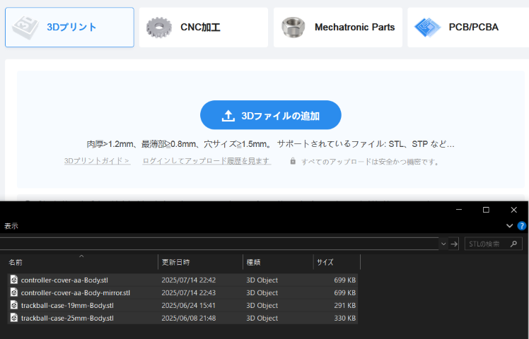

読み込んだすべてのファイルについて、商品概要は`エンクロージャー...`から`プラスチックエンクロージャ`を選択します。

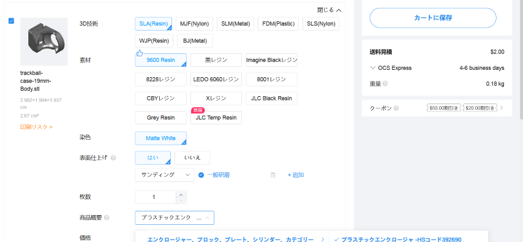

モデルのサムネイルの下に`印刷リスク`の表示がある場合は`はい`をチェックしてください。

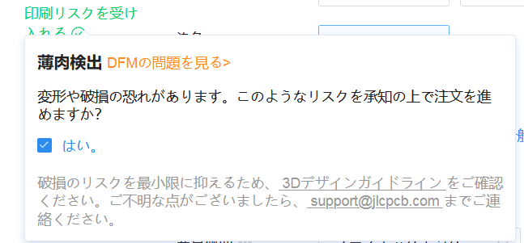

カートに保存し、注文手続きを進めます。配送方法、送料、割引の適用条件は発注時の見積もりで確認してください。

発注履歴が表示されるようになった状態で数分経ってからタブをリロードすると、ファイル名の横に!マークが表示されることがあります。

その場合は!マークをクリックし、`はい`を選択してください。

| 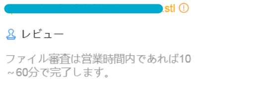 | 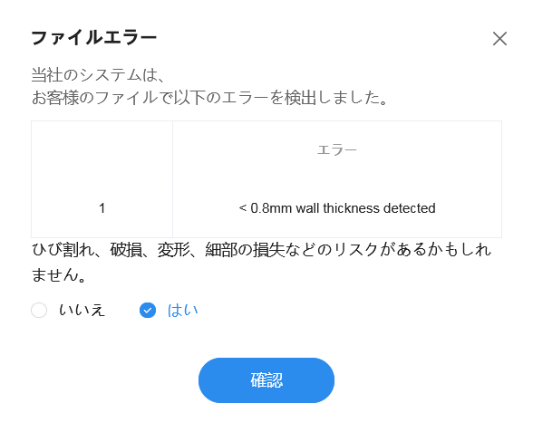 |
| ------------------------ | -------------------------- |

JLC3DPのレビューで問い合わせが来た場合は、指摘された薄肉部や寸法への影響を確認してから製造可否を回答してください。必要に応じてCADデータを修正します。


## メイン基板をJLCPCBへ発注する

リポジトリのルートで次を実行し、`pcb/jlcpcb/output/`に発注データを生成します。

```sh
bash pcb/jlcpcb/generate.sh
```

通常は`combined-gerbers.zip`を1件のPCBとしてアップロードし、`Different Design: 2`、`Panel by Customer`、標準の`0.3mm/(0.4/0.45mm)`ビア、Standard PCBA、裏面実装を選択します。BOM/CPLには`combined-bom.csv`と`combined-cpl.csv`を指定し、ファイル形式は`Complete File`を選択してください。ハンドリングレールとフィデューシャルはJLCPCBに追加してもらいます。詳しい設定は[`pcb/jlcpcb/README.md`](pcb/jlcpcb/README.md)を参照してください。

左右を個別に発注する場合は、従来どおり`left-*`と`right-*`をそれぞれ使用できます。どちらの方法でも、アップロード後の部品配置プレビューでダイオードの向きを確認してください。

右側のXIAO nRF52840 Plus、左右のSamtec FTSHコネクタ、Chocソケット、FFC変換基板はBOM/CPLから除外されているため、別途用意して手はんだします。昇圧回路、電池関連部品、電源スイッチはありません。


## 組立手順


### トッププレートのトラックボール搭載部分を切り離す（PCB製プレートのみ）

3Dプリント製トッププレートではこの作業は不要です。PCB製トッププレートを使用し、ニッパーでそのまま切り離せない場合は、表裏に切れ目を入れてから折り取ってください。

### スイッチソケットをはんだ付けする

PCBAを利用した場合、ダイオードは実装済みです。ダイオードの向きがシルク表示と合っていることを確認してから、Chocソケットを手はんだします。PCBのみを発注した場合は、先に1N4148Wもはんだ付けしてください。

|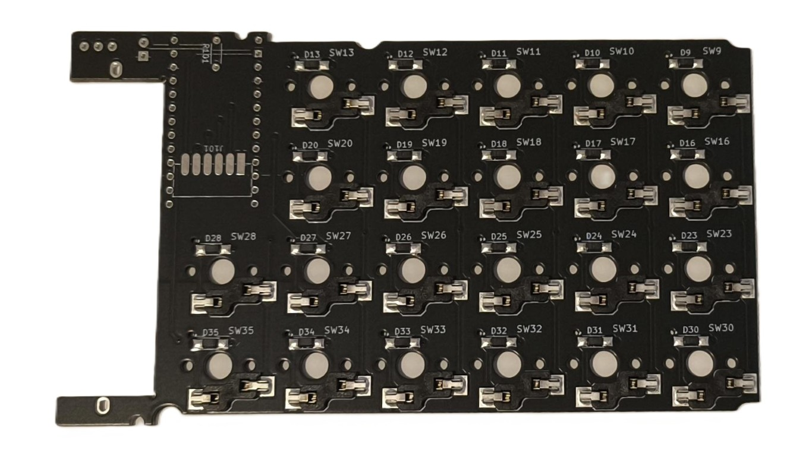|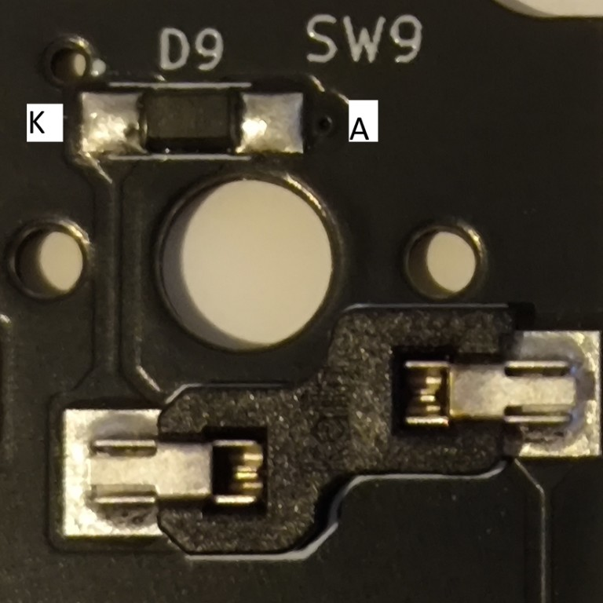|
|-|-|

### 右側にXIAOをはんだ付けする

Seeed Studio XIAO nRF52840 Plusは右側だけに表面実装します。左側は受動マトリクスなのでXIAOを搭載しません。XIAOをシルクの`USB-C`と`ANT`表示に合わせて仮置きし、外周端子とPCB側ランドが重なっていることを確認します。

外周の対角にある2端子を少量のはんだで仮固定し、位置がずれていなければ残りの外周端子をフラックスとはんだごてではんだ付けします。14個の標準端子に加え、間に並ぶ9個の細い端子も確認してください。PCB側のランドは外側へ延ばしてあります。隣の端子とのブリッジに注意します。

XIAO裏面の6端子に対応する位置には、PCBを貫通する直径0.6 mmのめっき穴があります。外周を固定した後、PCBを裏返し、各穴にフラックスを付けます。穴の銅めっきとその奥のXIAO端子を加熱して、裏側から少量ずつはんだを流し込みます。これらはピンヘッダを差し込む穴ではありません。`SWDIO`・`SWDCLK`・2つの`GND`を確実に接合してください。`RESET`と`BAT`は現行回路では未接続ですが、同じ方法ではんだ付けできます。作業後は隣接端子間の短絡がないことを確認します。

電源スイッチはありません。USB-Cケーブルを接続すると起動し、外すと電源が切れます。

### トラックボールセンサーのアダプタ変換基板をはんだ付けする

XIAOの裏面端子をはんだ付けしてから、右側PCB裏面の6つのランド（`J201`）にアダプタ変換基板を重ねてはんだ付けします。アダプタ基板の端がXIAO裏面端子用のめっき穴を覆っていないことを確認してください。ランドは端子穴との間隔を確保するため長さ3 mmです。隣接するランド間のブリッジと、めっき穴へのはんだの流れ込みに注意します。

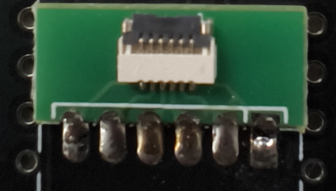

### 左右のSamtec FTSHコネクタをはんだ付けする

左右それぞれの`J101`／`J202`へFTSH-106-01-L-D-Kを表側から差し込み、基板シルクの「1」と部品の1番ピンを合わせて裏側ではんだ付けします。ソケットは基板上方から挿入します。裏面のはんだと端子がケースに触れないこと、全12端子にブリッジがないことを確認してください。

指定の既製FFSDケーブルを使用します。PCB上では左右の同番号端子に同じ役割を割り当てています。ピン配列は次のとおりです。

| ピン | 信号 |
| ---: | --- |
| 1 | LROW2 |
| 2 | COL4 |
| 3 | LROW0 |
| 4 | LROW1 |
| 5 | COL5 |
| 6 | COL6 |
| 7 | COL3 |
| 8 | COL2 |
| 9 | COL1 |
| 10 | GND |
| 11 | LROW3 |
| 12 | COL0 |

導通試験では各ピンが反対側の同番号だけにつながり、隣接ピンと短絡していないことを確認します。コネクタおよびケーブルの抜き差しはUSB-C電源を外してから行ってください。


### トッププレート・メイン基板にスイッチを差し込む

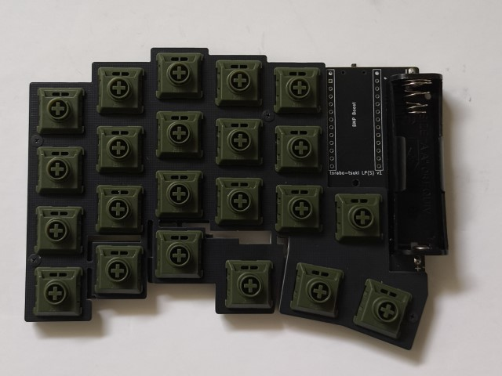

### ファームウェアを書きこむ

* このPCBはXIAO nRF52840 Plus用です。BLEMicroPro/BMP Boost用UF2には互換性がありません。
* 左右のFFSDケーブルを接続し、XIAOをPCにUSBケーブルで接続します。
* XIAOのRESET操作を素早く2回行ってUF2ブートローダーに入ります。必要に応じてXIAO上のRESET接点をGNDへ2回短絡します。
* このPCBには、右XIAO 1台で8行×7列を走査する専用ファームウェアが必要です。従来のCentral／Peripheral 2台構成のUF2は使用できません。
* [専用ファームウェアのGitHub Actions](https://github.com/beryu/zmk-keyboard-kb-1/actions)から現行基板用ビルドの成果物を取得し、`kb_1.uf2`をマウントされたストレージへコピーします。左側への書き込みは不要です。`settings_reset.uf2`はBluetooth設定のリセット用で、通常のファームウェアではありません。書き込み後はUSBケーブルを抜き、使用するUSB-C電源へ接続し直します。

### 3Dプリント外装ケースを準備する（3Dプリント外装のみ）

* 左右ボトムケースの各4か所にM2熱圧入インサートを取り付けます。下穴は直径3.2 mm、深さ4.0 mmです。
* 磁石を使う場合は、左右各4か所の直径12.1 mm、深さ1.0 mmのポケットへ取り付けます。左右の底面を合わせたときに対応する磁石が引き合う向きにしてください。
* ボトムケース内周にフォーム材を配置し、PCB上面がケースの縁と同じ高さになるように支えます。この位置ではPCB裏面とケース床の間隔は3.0 mmです。フォーム材はソケット、はんだ付け部、磁石ポケットを避けて配置し、ねじを締めたときの圧縮量を調整します。
* ケース底面のケーブル溝と上面のFFSD開口、右側USB-C開口で、実際のケーブルが無理なく通ることを確認します。

### トッププレートにスペーサーをねじ止めする（PCB製プレートのみ）

* PCB製トッププレートには4.5 mmスペーサーをねじ止めします。3Dプリント外装ではボトムケースのボスとインサートを使用するため、この作業は不要です。

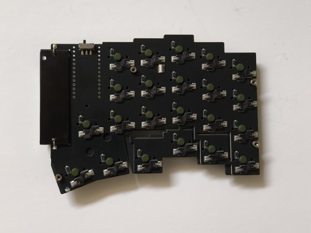

### トラックボールケースにベアリングをネジで固定する

* ケースに空いている穴にねじを押し込みながら回すようにしてベアリングを固定します。
* ベアリングは多少ガタつきますが問題ありません。

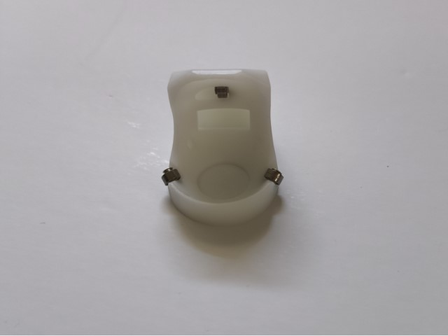

### トラックボールセンサーにケーブルを差し込む

* コネクタのフラップ（黒い部分）を上に持ち上げ、トラックボールのケーブルをしっかり奥まで差し込み、フラップを下げます。
  * [コネクタの操作方法と注意点をよく確認してください](https://www.hirose.com/ja/product/document?clcode=&productname=&series=FH19C__FH19SC&documenttype=Catalog&lang=ja&documentid=D31611_ja)

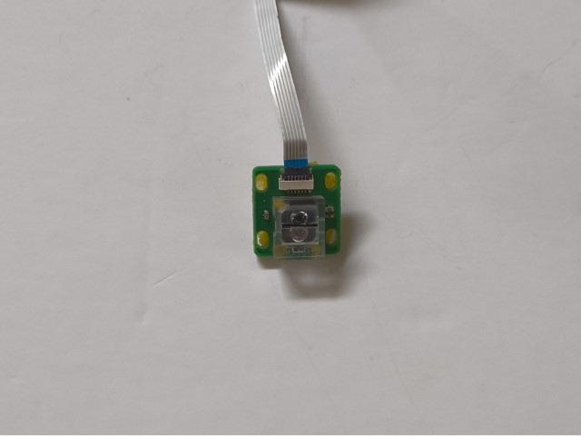

### トラックボールのケーブルをメイン基板のコネクタに差し込む

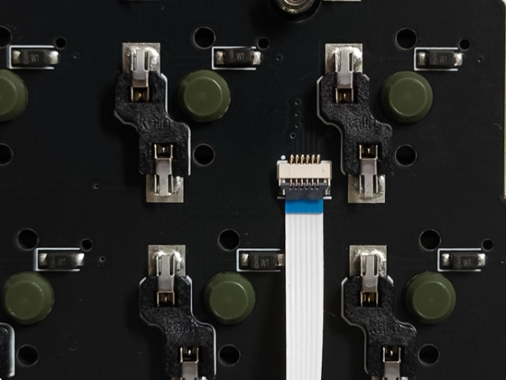

### センサーの動作確認をする

* XIAOへUSB-Cで給電し、PCとBluetoothでペアリングします。公開ファームウェアではUSB HID出力が無効のため、USBケーブルをつなぐだけではカーソルは動きません。
* センサーのレンズ側を机から2mmくらい浮かせてセンサー基板を動かしたり、レンズの上空を指で動かしたりしてマウスカーソルが動くならば、センサーは正常に動作しています。 
* センサーの動作確認ができたらUSBケーブルは取り外してください。

### トラックボールセンサーをケースに取り付ける

* センサーガイド追加版では、元ケースと同じ向きで基板端を側面の溝に合わせ、中央まで滑り込ませます。溝は両側に貫通しているため、どちら側からでも挿入・取り外しできます。
* 長辺方向のストッパーはありません。レンズ位置をボールに合わせて調整してください。
* きつい場合は無理に押し込まず、[センサー溝の調整説明](3d-models/FreeCAD/TRACKBALL-SENSOR-FIT.md)に従って印刷余裕を調整します。
* トラックボールの反応が悪い場合には取り付け位置を調整してください。

|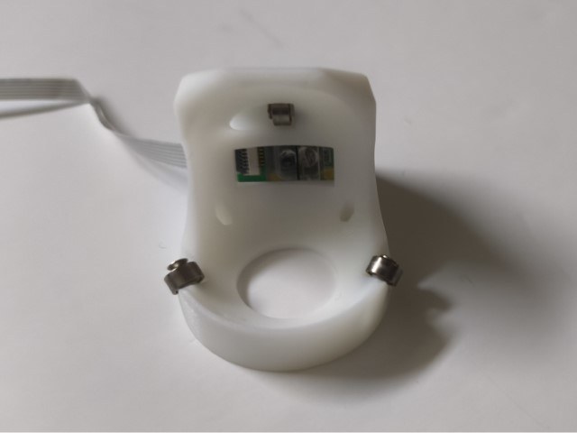|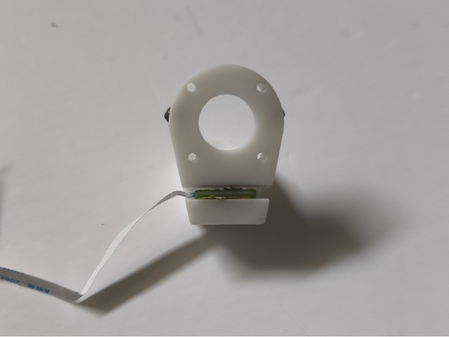|
|-|-|

### ボトムプレートまたはボトムケースを取り付け、トラックボールケースを固定する

* PCB製プレートでは、スペーサーにボトムプレートを固定します。
* 3Dプリント外装では、フォーム材で支持したPCBにトッププレートを重ね、左右各4本のM2×3.5 mm低頭ねじまたは確認済みM2×4 mm超低頭ねじでボトムケースのインサートへ固定します。
* トラックボールケースは右側ボトムプレートまたはボトムケースへ、M2×3.5 mm低頭ねじで固定します。3Dプリント製ボトムケースでは長穴に沿って位置を調整し、FFCケーブルを壁のスリットへ通して、挟み込みがないことを確認します。

以下はPCB製プレートの組立写真です。

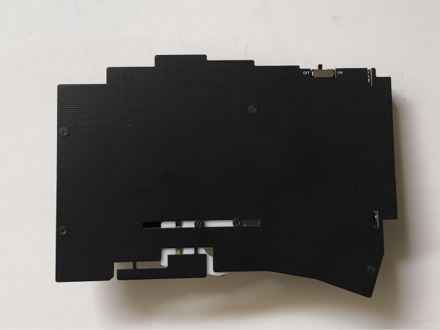

### トラックボールケースにボールを入れる

* ボールをケースに押し込んで入れます。

### ゴム足を付ける

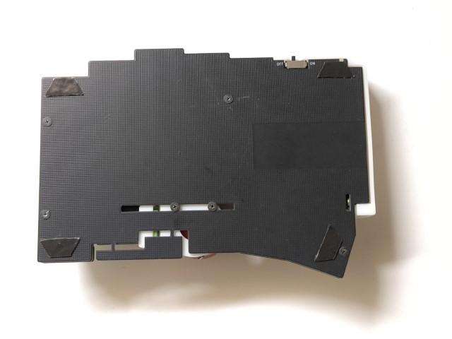

### キーキャップを取り付ける

**以上で組立は完了です、お疲れさまでした。**

## 使い方

### 電源の説明

* 左右のFFSDケーブルを接続してから、右XIAOのUSB-Cへ給電します。USB-Cケーブルを接続すると電源ON、外すと電源OFFです。
* PCとBluetooth接続したい場合は、モバイルバッテリーまたはUSB電源アダプターから給電します。公開ファームウェアではUSB HID出力が無効です。PCのUSB端子から給電する場合も、キーとポインターの入力にはBluetooth接続を使用します。

### 無線接続

* USB-C給電し、接続先のデバイスでペアリングします。

### キーマップを変更する

* [ZMK Studio](https://zmk.studio/)では、PCとBluetooth接続した状態でキーマップを変更できます。
* [Keymap-Editor](https://nickcoutsos.github.io/keymap-editor/)でファームウェアのキーマップを編集することもできます。
* Keymap-Editorを使用する場合は[FORT-48専用ファームウェア](https://github.com/beryu/zmk-keyboard-kb-1)をクローンして編集してください。

## FAQ

まずはZMKのドキュメントを確認してください。

### 無線接続に問題がある

* 電源が入っているか確認してください。
* ZMKのドキュメントを確認してください。

### トラックボールの動きだしが遅い

* 一定時間ボールを動かさなかった場合にセンサーがスリープ状態になります。スリープ状態の解除に少し時間がかかるため動き出しが遅くなる場合があります。

### トラックボールの動きがおかしい/動かない

* [センサーの位置調整](#トラックボールセンサーをケースに取り付ける)をご確認ください。
* トラックボールのケーブルがコネクタにしっかりささっているか確認してください。
* センサーの仕様として、最大速度24inch/s、最大加速度10Gという制約があります。19.05mmボールの回転速度に換算すると約10回転/sが最大速度で、これを超える速度で回転させた場合にはカーソルが逆方向に動くことがあります。

### 一部のキーが入力できない

* スイッチの足が折れ曲がっていないか、ソケットやダイオードのはんだ付け・向きに問題がないか確認してください。

### トラックボールの移動速度を変えたい/オートマウスレイヤー/スクロールレイヤーを使用したい

* ZMKのinput processorを使用してください。
